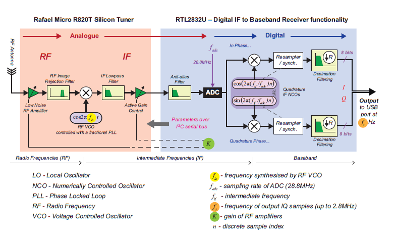

# Software-Define Marine VHF Radio
The goal of this project is to receive VHF marine radio signals using an RTL-SDR dongle, an antenna, and GNU radio.

## How It Works
It is easiest to understand how this works by stepping through each stage of signal.

The signal starts as an EM wave. For marine VHF channels, the frequency spectrum is from about 156MHz to 162MHz.
Each channel has a bandwidth of about 50kHz. The channel used in this project is channel 68, which operates at 156.425 MHz 
(so from 156.40 MHz to 156.450 MHz). These channels use frequency modulation for encoding information, and more specifically,
narrowband frequency modulation, since the bandwidth is only 25 kHz.

The signal reached the antenna of the receiver. From there, it goes through two processes. The first is the shift to an
analogue intermediate frequency (IF). After that, the IF signal is fed to a quadrature mixer where it is shifted to baseband frequency.

The diagram below shows how this all connects. 

#### Quadrature Primer
Quadrature signals were very confusing to me during this process, but I eventually got the hang of them. This is my
best explanation about how they function.

It is best to start from the problem they solve. Let's say our signal is currently sitting at a carrier frequency of 100MHz.
In order to process this information, we need to shift the signal down to a lower frequency. This can be done using a basic
cosine mixer. But, multiplication in the time domain is convolution in frequency, and since cosine has two frequency
spike at the positive and negative frequency, it actually causes a shift both up and down of the original. This becomes
an issue when the upward and downward shifts begin overlapping with each other.

Quadrature mixing/demodulation solves this issue and provides many more benefits (I just picked this example because
it clicked with me). We know that if we multiply our input signal, say r(t), with e^-jw_ot, then we are solely 
downshifting the frequency. Since e^-jw_ot is not a "real" signal, we instead write it in different notation
cos(w_ot) - jsin(w_ot). Therefore, we multiply the signal with these two terms separately (and ignoring j). The two
numbers we get represent a complex number on which we can do our calculations.

#### Stepping Through the Process
The first step of processing from the RTL-SDR is the demodulation down to baseband. This is done using the RTL-SDR block in GNU radio.
Since the station I was interested in operates at 156.425 MHz, this is what I tuned the station to. The process of getting this signal down to baseband is
as follows: first, an analog mixer moves the frequency to an intermediate frequency. Then, the signal is sampled and moved to baseband through quadrature mixing.

From there, I passed the signal through a low-pass filter. I set the cutoff frequency as 12.5 kHz with a transition width of 5 kHz since this channel is
a narrow band FM station. After this filter, I decimated the signal by 5, meaning the effective sampling rate at this stage is 480 kHz. This
speeds up processing at the later stages, as we do not need the higher frequencies anymore.

At this point, the signal should be ready for demodulation. I used a Narrow-Band Frequency Modulation receiving block.
The quadrature rate was set to 480 kHz since this is the output from the previous decimation, and the audio rate is 48 kHz since
that is what my soundcard accepts.

Along each of these steps, I included the time plot and frequency plot to ensure each step served its functions properly.